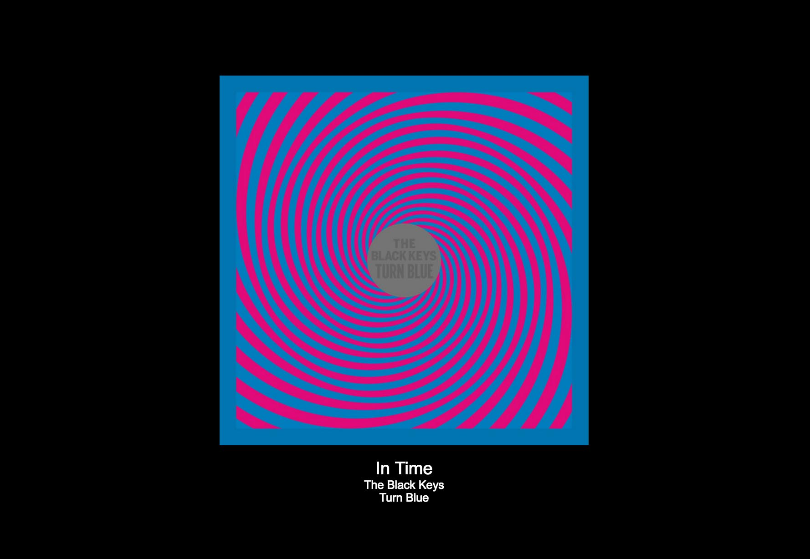

Resin.io app based on Electron that displays album art of currently-playing Sonos songs.
 

 
# Requirements

* Raspberry Pi. Any version should work; the Dockerfile will compile to the correct architecture.
 
# Instructions

1. Clone this repo
2. Set up a resin.io app and push your code to it following [these instructions]((https://docs.resin.io/raspberrypi3/nodejs/getting-started/))
3. Plug your Raspberry Pi into your TV
4. You're done! The app will discover Sonos devices on your network and display the album art of the currently-playing song